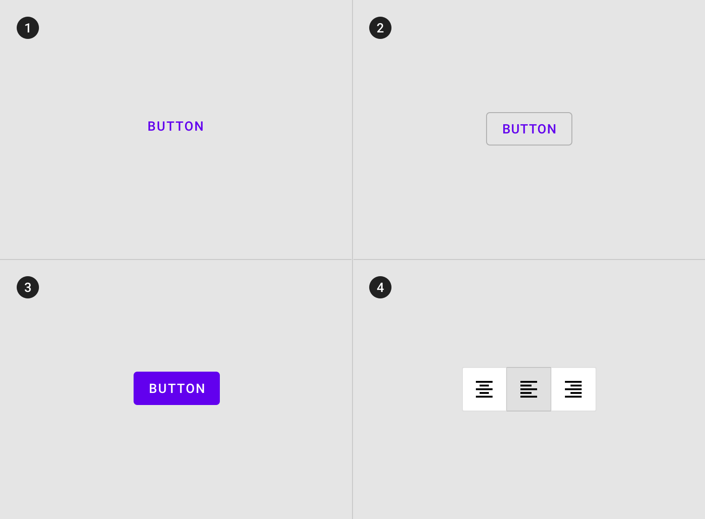

<!--docs:
title: "Button"
layout: detail
section: components
excerpt: "A customizable button component with updated visual styles."
iconId: button
path: /catalog/material-button/
-->

# Button

This customizable button component has updated visual styles. This button component has several built-in styles to support different levels of emphasis, as typically any UI will contain a few different buttons to indicate different actions.

For more information, go to the material.io [Buttons](http://material.io/components/buttons) page.

The button component consists of two separate material components that implement the following variants:
* [`MaterialButton`](MaterialButtonExample.md)
   * Text button
   * Outlined button
   * Contained button (filled and raised)
* [`MaterialButtonToggleGroup`](MaterialButtonToggleGroupExample.md)
   * Toggle button

